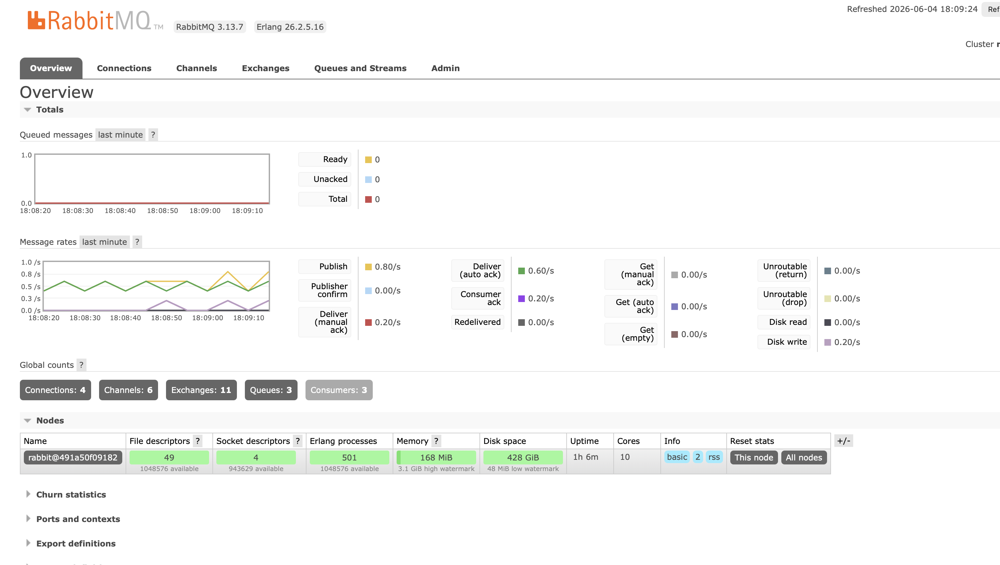

# Двухсервисная система LLM-консультаций

## Проект состоит из двух независимых сервисов:

### Auth service - отвечает за регистрацию, выдачу JWT  и логин 
### Bot service - бот в телеграмме с ЛЛМ консультациями через сервис OpenRouter

## Технологии

**FastAPI**  веб-фреймворк

**Aiogram**  Telegram Bot API

**Celery**  асинхронные задачи

**RabbitMQ**  брокер сообщений

**Redis**  кэширование и хранение токенов

**SQLite**  база данных пользователей

**OpenRouter**  API для LLM

**Docker**  контейнеризация инфраструктуры

## Сценарий работы:
1.Регистрация в auth service через Swagger:http://localhost:8000/docs .Используем формат( surname@email.com)
2.Получение токена login
3.Отправляем полученый токен боту в телеграмме 
4.Все готово для работы

## Скриншоты:
1) Регистрация

2)Получение JWT

3) Авторизация

4)Демонстрация взаимодействия с ботом

5)Демонстрация работы RabbitMQ

6)Тесты

