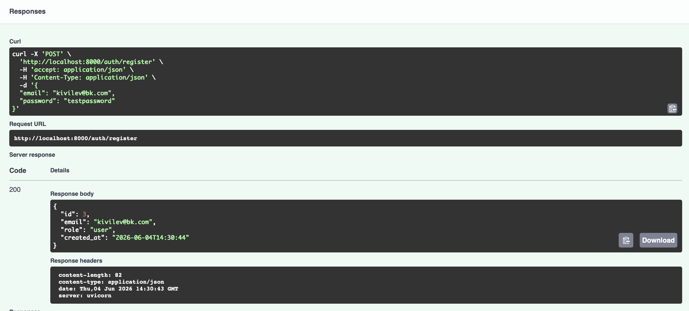
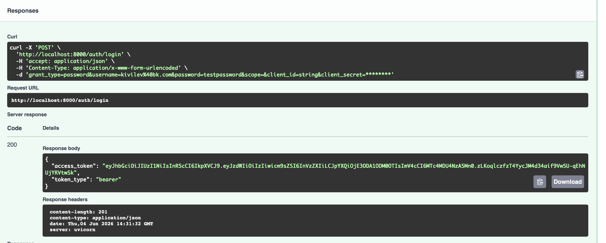
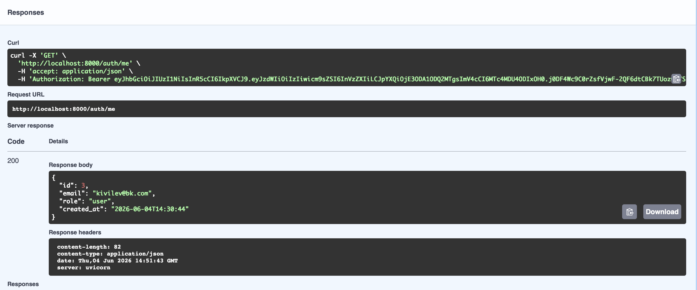
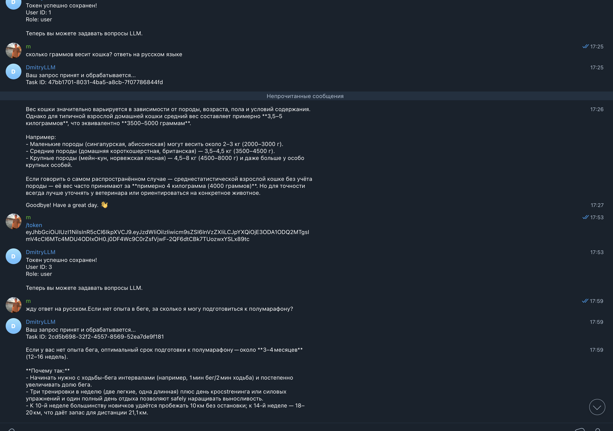
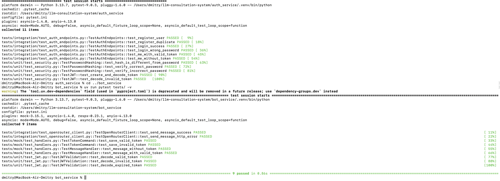

# Двухсервисная система LLM-консультаций

## Проект состоит из двух независимых сервисов:

### Auth service - отвечает за регистрацию, выдачу JWT  и логин 
### Bot service - бот в телеграмме с ЛЛМ консультациями через сервис OpenRouter

## Технологии

**FastAPI**  веб-фреймворк
**Aiogram**  Telegram Bot API
**Celery**  асинхронные задачи
**RabbitMQ**  брокер сообщений
**Redis**  кэширование и хранение токенов
**SQLite**  база данных пользователей
**OpenRouter**  API для LLM
**Docker**  контейнеризация инфраструктуры

## Сценарий работы:
1.Регистрация в auth service через Swagger:http://localhost:8000/docs .Используем формат( surname@email.com)
2.Получение токена login
3.Отправляем полученый токен боту в телеграмме 
4.Готово к работе

## Скриншоты:

